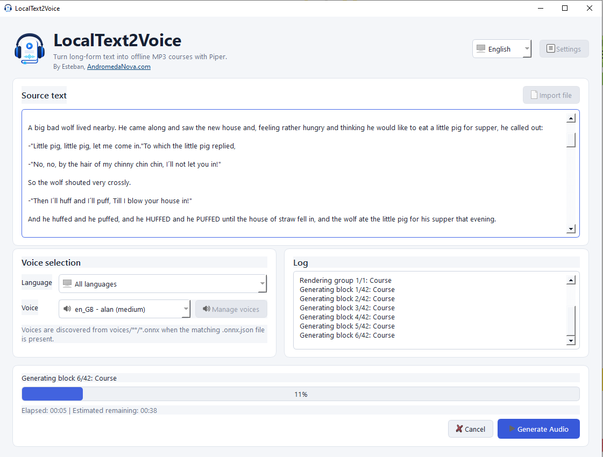
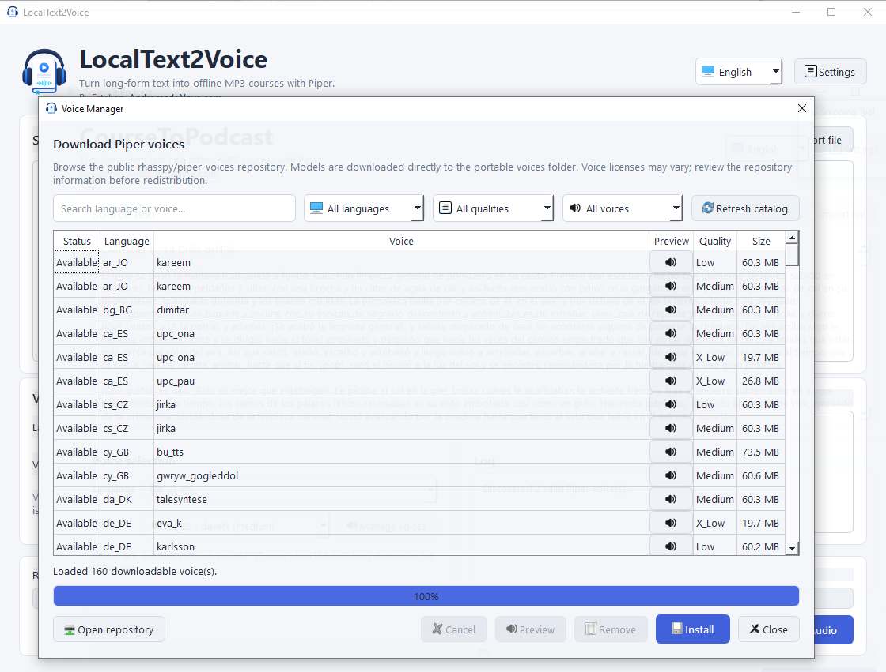
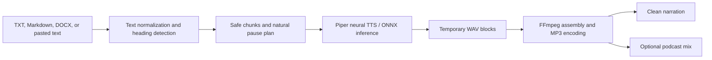

<p align="center">
  
</p>

<h1 align="center">LocalText2Voice</h1>

<p align="center">
  <strong>Open-source, offline AI text-to-speech for long-form content.</strong><br>
  Convert documents into MP3 narration, podcasts, audiobooks, lessons, and course audio on Windows.
</p>

<p align="center">
  <a href="https://github.com/estebanstifli/LocalText2Voice/releases/latest"></a>
  <a href="https://github.com/estebanstifli/LocalText2Voice/blob/main/LICENSE"></a>
  
  
  
</p>

<p align="center">
  <a href="https://github.com/estebanstifli/LocalText2Voice/releases/latest"><strong>Download for Windows</strong></a>
  ·
  <a href="https://github.com/estebanstifli/LocalText2Voice/raw/main/docs/audio/localtext2voice-demo-en.mp3"><strong>Listen to an MP3 demo</strong></a>
  ·
  <a href="https://andromedanova.com"><strong>AndromedaNova.com</strong></a>
</p>

LocalText2Voice is a lightweight Python and PySide6 desktop application that
runs neural text-to-speech locally with [Piper TTS](https://github.com/rhasspy/piper).
It is designed for long documents, works without a GPU, and uses
[FFmpeg](https://ffmpeg.org/) to produce clean narration or a complete podcast
mix with music, fades, loudness normalization, and ducking.

> **Resumen en español:** aplicación de escritorio open source que convierte
> textos largos en voz y podcasts MP3 mediante inteligencia artificial local.
> Funciona sin conexión, sin GPU y con voces Piper descargables desde la propia
> interfaz.

## Screenshots

### Generate long-form audio without freezing the interface



### Browse, preview, download, and manage multilingual Piper voices



## Why LocalText2Voice?

- **Private by default:** text and speech synthesis stay on the computer.
- **Built for long content:** safe text chunking, chapter detection, paragraph
  pauses, and sequential output files.
- **No GPU required:** Piper provides fast neural TTS inference on normal CPUs.
- **Podcast-ready:** keep clean narration and optionally create a second mix
  with intro, background music, outro, fades, normalization, and ducking.
- **Portable Windows app:** extract a folder, run the executable, and download
  a voice from the built-in manager.
- **Open architecture:** new local or cloud TTS engines can implement one
  stable interface without rewriting the application.

Typical uses include course narration, study materials, accessibility,
podcasts, audiobooks, training content, articles, documentation, and
voice-over drafts.

## Features

### Offline AI speech synthesis

- Local neural TTS with Piper and ONNX voice models.
- Optional API engines for OpenAI TTS, ElevenLabs, and Azure Speech.
- Optional Kokoro local engine with on-demand model download to the user's
  local app data folder. The Windows portable build includes the Kokoro CPU
  runtime, but not the large Kokoro model assets.
- Optional Chatterbox local GPU engine for advanced voice cloning and
  expressive multilingual speech, installed as a separate runtime pack.
- Built-in voice catalog with language/quality filters.
- Remote voice sample playback before downloading a model.
- Background downloads with cancellation, size validation, SHA-256 checks,
  and atomic installation.
- Voice speed control and automatic discovery of installed models.
- No cloud account, API key, GPU, or global Piper installation required.

### Long-form text processing

- Paste text or import `.txt`, `.md`, and `.docx` files.
- Normalize whitespace and unsupported characters.
- Preserve paragraph boundaries and split long text into TTS-safe blocks.
- Detect Markdown headings, chapters, lessons, modules, and short uppercase
  headings.
- Export one MP3 or one MP3 per chapter.
- Natural randomized paragraph pauses with adaptive timing after long
  paragraphs and periodic reading breaks.

### Podcast production

- Export clean narration as `podcast1.mp3`, `podcast2.mp3`, and so on without
  overwriting previous work.
- Create a separate podcast mix while retaining the clean narration.
- Optional intro, looped background music, and outro from MP3 or WAV files.
- Music volume, fade in/out, and silence between sections.
- Basic FFmpeg sidechain ducking while the voice is speaking.
- Optional loudness normalization to `-16 LUFS`.
- Configurable MP3 bitrate and ID3 title, artist, and album metadata.

### Desktop experience

- Responsive PySide6 interface with worker-thread generation.
- Live block progress, elapsed time, estimated remaining time, and visible log.
- Safe cancellation of the active Piper process and temporary-file cleanup.
- Open-output-folder action after generation.
- English, Spanish, French, German, Italian, Portuguese, Simplified Chinese,
  Japanese, Arabic, and Hindi interface translations.
- Right-to-left layout support for Arabic.

## Quick Start on Windows

1. Open the [latest release](https://github.com/estebanstifli/LocalText2Voice/releases/latest).
2. Download `LocalText2Voice-v0.4.0-windows-x64.zip`.
3. Extract the ZIP to a folder where you have write permission.
4. Run `LocalText2Voice.exe`.
5. Open **Manage voices**, preview a voice, and download it.
6. Paste or import your text, choose the voice, and select **Generate Audio**.

The portable release includes the application, Piper runtime, Kokoro CPU
runtime, and FFmpeg. Piper voice models, Kokoro model assets, and optional
Chatterbox GPU assets are downloaded or installed separately because their
licenses, model cards, package size, and hardware requirements can differ.

### Audio example

[Listen to the English MP3 demo generated locally with Piper TTS](https://github.com/estebanstifli/LocalText2Voice/raw/main/docs/audio/localtext2voice-demo-en.mp3)

The demo was generated by LocalText2Voice with the `en_GB-alan-medium` Piper
voice. It contains no cloud-generated speech.

## How It Works



## AI Engineering Highlights

LocalText2Voice is an applied AI engineering project rather than a model
training project. It integrates pretrained neural speech models into a
reliable end-user workflow:

- **Local model inference:** orchestrates Piper ONNX voices through an isolated
  subprocess adapter with executable and model validation.
- **Model lifecycle management:** discovers a remote model catalog, previews
  samples, validates downloads, and installs voices atomically.
- **NLP-oriented preprocessing:** applies language-agnostic text cleanup,
  sentence-aware chunking, heading heuristics, and prosody-oriented pause
  planning for long-form synthesis.
- **Production concurrency:** keeps the GUI responsive with Qt worker threads,
  progress signals, ETA calculation, cancellation, and child-process cleanup.
- **Audio DSP pipeline:** composes narration and music with FFmpeg filters for
  looping, fading, sidechain compression, metadata, and loudness normalization.
- **Extensible providers:** isolates TTS behind `BaseTTSEngine` and reserves a
  provider interface for future LLM-assisted course generation.

This demonstrates practical experience with AI model integration, ONNX-based
inference, desktop product engineering, multimedia processing, asynchronous
workflows, internationalization, packaging, and automated testing.

## Technology Stack

| Technology | Role |
| --- | --- |
| Python 3.10+ | Application, processing pipeline, configuration, and tests |
| PySide6 / Qt 6 | Native desktop interface, signals, threads, and i18n-ready UI |
| Piper TTS | Fast local neural text-to-speech engine |
| Kokoro ONNX | Optional higher-quality local CPU TTS engine |
| Chatterbox TTS | Optional advanced local GPU TTS and voice cloning engine |
| ONNX voice models | Portable pretrained speech models |
| FFmpeg | WAV assembly, MP3 encoding, mixing, ducking, fades, and loudnorm |
| PyInstaller | Portable Windows folder distribution |
| python-docx | Optional Microsoft Word document import |

## Architecture

```text
LocalText2Voice/
|-- main.py
|-- app/
|   |-- core/       # Text processing, settings, project and audio pipeline
|   |-- tts/        # Engine interface, Piper adapter and voice management
|   |-- ui/         # PySide6 windows and reusable widgets
|   |-- workers/    # Background generation and download workers
|   |-- utils/      # Paths, logging and FFmpeg helpers
|   `-- llm/        # Future provider interface; no cloud integration yet
|-- locales/        # Auto-discovered JSON translations
|-- engines/piper/  # Portable Piper runtime
|-- engines/kokoro/ # Portable Kokoro CPU runtime
|-- engines/chatterbox/ # Optional Chatterbox GPU runtime pack
|-- voices/         # External ONNX voice models
|-- ffmpeg/         # Portable FFmpeg executable
|-- music/          # Optional intro, background and outro library
|-- tests/
`-- output/
```

The audio pipeline depends on the abstract `BaseTTSEngine` contract. Piper is
the default local implementation. Kokoro is available as an optional local
engine with an included CPU runtime and on-demand model download. Chatterbox is
available as an advanced local GPU engine through a separate runtime pack.
OpenAI TTS, ElevenLabs, and Azure Speech are available as API engines. Future
local engines such as XTTS can be added later without coupling them to the UI.

## Run from Source

Python 3.10 or newer is recommended:

```powershell
git clone https://github.com/estebanstifli/LocalText2Voice.git
cd LocalText2Voice
py -m venv .venv
.\.venv\Scripts\Activate.ps1
python -m pip install --upgrade pip
python -m pip install -r requirements.txt
python main.py
```

The repository excludes large third-party binaries and voice models. Place the
Windows Piper runtime in `engines/piper/` and FFmpeg in `ffmpeg/`, or point the
application settings at compatible local installations. Voices can be
installed from **Manage voices**.

Expected Piper files:

```text
engines/piper/
|-- piper.exe
|-- required DLL files
`-- espeak-ng-data/
```

Expected voice pair:

```text
voices/es_ES/davefx/medium/
|-- es_ES-davefx-medium.onnx
`-- es_ES-davefx-medium.onnx.json
```

FFmpeg is resolved from `ffmpeg/ffmpeg.exe` first and then from the Windows
`PATH`. MP3 export requires the `libmp3lame` encoder.

## Configuration

The application creates `config.json` beside the executable or source project.
If the file is missing, safe defaults are created automatically.
`config.example.json` documents the available values, including:

- output folder, voice, language, speed, split mode, and export mode;
- selected voice generation engine: Piper local, Kokoro local, OpenAI TTS,
  ElevenLabs, or Azure Speech;
- optional Kokoro voice and CPU provider settings;
- API provider settings such as API keys, model IDs, voice IDs, Azure region,
  output format, and style parameters;
- Piper and FFmpeg paths;
- chunk size and block/chapter pauses;
- randomized and adaptive paragraph pause rules;
- MP3 bitrate, metadata, and clean-audio normalization;
- intro, background, outro, fades, gaps, ducking, and podcast normalization.

## Build the Portable App

```bat
build_windows.bat
```

The build uses PyInstaller `--onedir` mode and creates:

```text
dist/LocalText2Voice/
|-- LocalText2Voice.exe
|-- engines/
|-- voices/
|-- ffmpeg/
|-- music/
|-- output/
|-- licenses/
|-- config.example.json
|-- LICENSE
`-- THIRD_PARTY_NOTICES.md
```

Piper, voices, and FFmpeg remain outside the main executable so they can be
updated independently. If `engines/kokoro/kokoro_engine.exe` exists, the
portable folder also includes that CPU runtime while still downloading Kokoro
model assets on demand. Do not redistribute a voice until you have reviewed its
model card and dataset license. Third-party license texts are copied into the
portable folder under `licenses/`.

### Optional Kokoro Engine

The Windows portable build can include `engines/kokoro/kokoro_engine.exe`, a
CPU-only Kokoro runtime. The large Kokoro model assets are still not bundled;
the application downloads the Kokoro ONNX model and voice bundle on demand to:

```text
%LOCALAPPDATA%/LocalText2Voice/models/kokoro/
```

The app expects the runtime at:

```text
engines/kokoro/kokoro_engine.exe
```

If it is missing from a development checkout, build it with:

```bat
build_kokoro_engine.bat
```

The Kokoro engine currently runs in CPU mode. The configuration and CLI already
reserve `auto`, `cuda`, and `directml` provider names for future builds, but
the included Windows runtime does not bundle GPU providers.

### Optional Chatterbox GPU Engine

Chatterbox is treated as an advanced local engine because it depends on
PyTorch and benefits strongly from a CUDA-capable NVIDIA GPU. The main
LocalText2Voice executable does not depend on Chatterbox.

For end users, the Chatterbox **Install** button downloads the runtime pack from
GitHub Releases:

```text
https://github.com/estebanstifli/LocalText2Voice/releases/download/chatterbox-runtime-v1/LocalText2Voice-Chatterbox-CUDA.zip
```

The runtime is installed to:

```text
%LOCALAPPDATA%/LocalText2Voice/runtimes/chatterbox/
```

For development or release preparation, build the runtime pack with:

```bat
build_chatterbox_engine.bat
```

Expected runtime path:

```text
engines/chatterbox/chatterbox_engine/chatterbox_engine.exe
```

The build also creates:

```text
release_assets/LocalText2Voice-Chatterbox-CUDA.zip
release_assets/LocalText2Voice-Chatterbox-CUDA.zip.sha256
```

Model files are downloaded on demand to:

```text
%LOCALAPPDATA%/LocalText2Voice/models/chatterbox/
```

The Chatterbox panel supports:

- Chatterbox Multilingual V3, English, and Turbo model modes;
- CUDA, Auto, CPU fallback, and Apple MPS device choices;
- optional reference audio for voice cloning;
- consent checkbox for reference-voice usage;
- emotion exaggeration and CFG weight controls.

Turbo mode requires a reference audio file. For long-form content, the
existing chunking pipeline is reused, but this first integration launches the
external runtime per chunk. A later optimization should add a persistent
Chatterbox worker/server mode to keep the model loaded during a full book or
course generation.

## Tests

```powershell
python -m unittest discover -s tests -v
```

The test suite covers text normalization, safe splitting, chapter detection,
settings, output naming, natural pauses, localization, and voice catalog
behavior. End-to-end synthesis additionally requires real Piper, voice, and
FFmpeg files.

## Roadmap

- [x] Offline Piper TTS generation for long-form text
- [x] Downloadable voice catalog with remote previews
- [x] Clean narration and music-backed podcast exports
- [x] Natural pauses, progress, ETA, cancellation, and multilingual UI
- [x] Optional API engines for OpenAI TTS, ElevenLabs, and Azure Speech
- [x] Optional Kokoro local engine with dynamic model installation
- [x] Optional Chatterbox local GPU engine scaffolding and runtime integration
- [ ] Short product video and animated workflow demo
- [ ] Visual chapter editor before synthesis
- [ ] More local engines such as XTTS
- [ ] PDF and richer document import
- [ ] Optional LLM-assisted lesson and course generation
- [ ] Signed Windows installer, automatic updates, and release automation

## Contributing

Issues, feature proposals, translations, and pull requests are welcome. Read
[CONTRIBUTING.md](CONTRIBUTING.md) before submitting a change. Please never add
large voice models, copyrighted music, API keys, or generated build folders to
the repository.

## License

LocalText2Voice source code is released under the [MIT License](LICENSE).
Piper, FFmpeg, PySide6/Qt, voice models, and other dependencies keep their own
licenses. See [THIRD_PARTY_NOTICES.md](THIRD_PARTY_NOTICES.md) before
redistributing a portable build.

## Author

Created by [Esteban](https://andromedanova.com) at
[AndromedaNova.com](https://andromedanova.com).

If LocalText2Voice helps your work, starring the repository makes the project
easier to discover.
