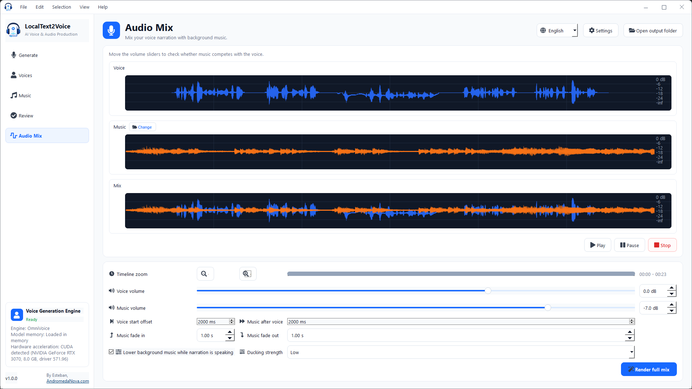
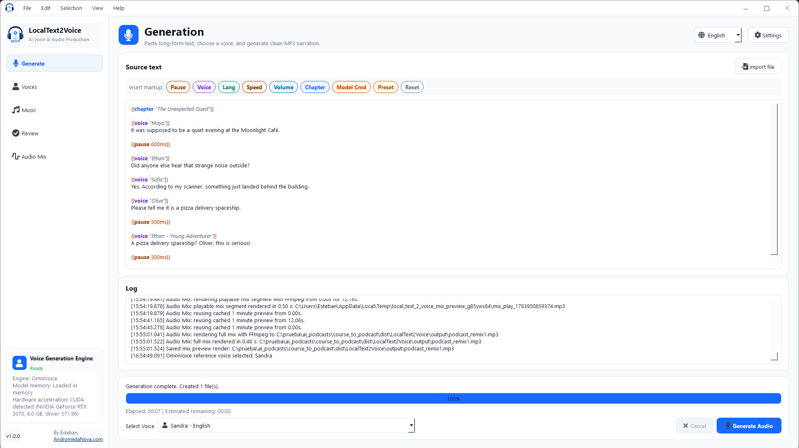
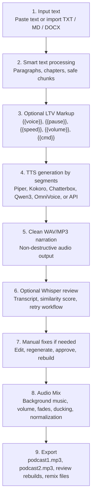

<p align="center">
  
</p>

<h1 align="center">LocalText2Voice</h1>

<p align="center">
  <strong>Free, open-source AI voice and audio production for long-form text.</strong><br>
  Turn books, lessons, articles, notes, and courses into MP3 audiobooks and podcast-style audio on Windows.
</p>

<p align="center">
  <a href="https://github.com/estebanstifli/LocalText2Voice/releases/latest"></a>
  <a href="https://github.com/estebanstifli/LocalText2Voice/blob/main/LICENSE"></a>
  
  
  
  
</p>

<p align="center">
  <a href="https://github.com/estebanstifli/LocalText2Voice/releases/latest/download/LocalText2Voice-Setup.exe"><strong>Download Windows installer</strong></a>
  ·
  <a href="docs/LTV_MARKUP.md"><strong>Markup manual</strong></a>
  ·
  <a href="https://andromedanova.com"><strong>AndromedaNova.com</strong></a>
</p>

LocalText2Voice is a desktop app for creating long-form spoken audio with AI text-to-speech. It can run fully local and offline with engines such as Piper, Kokoro, Chatterbox, Qwen3 TTS, and OmniVoice, while also leaving room for optional cloud APIs such as OpenAI TTS, ElevenLabs, Google Gemini TTS, and Azure Speech.

The goal is simple: paste or import a long text, choose a voice engine, generate clean narration, review the result, and optionally create a polished podcast mix with music, fades, ducking, and normalization.

> **Resumen en español:** LocalText2Voice es una aplicación gratuita y open source para convertir libros, cursos y textos largos en audiolibros o podcasts MP3 usando IA de voz. Puede funcionar 100% local/offline con modelos descargables, sin suscripciones ni enviar tus textos a la nube. Las APIs externas son opcionales.

## Why It Matters

- **Free local workflow:** no subscription is required for local TTS engines.
- **Privacy-first:** with local engines, your texts and generated audio stay on your PC.
- **Works on normal computers:** Piper and Kokoro can run without a powerful GPU.
- **Scales up on strong PCs:** Chatterbox, Qwen3 TTS, and OmniVoice can use NVIDIA CUDA when available.
- **Long-form first:** built for chapters, lessons, audiobooks, courses, and large documents.
- **Review loop included:** optional Faster Whisper verification compares generated audio against the original text.
- **Podcast-ready:** export clean narration and then create an Audio Mix with background music.
- **Extensible AI architecture:** local engines and cloud providers are isolated from the UI.

## Screenshots

### Audio Mix With Music



### Markup Editor



## Complete Workflow

LocalText2Voice is no longer just "text to speech". It is becoming a complete local audiobook and podcast production pipeline.



## Main Features

### AI Text-To-Speech Engines

LocalText2Voice supports multiple voice generation engines through a modular TTS architecture.

| Engine | Type | Best For | Notes |
| --- | --- | --- | --- |
| Piper | Local/offline CPU | Fast, reliable narration on modest PCs | Default stable engine |
| Kokoro | Local/offline CPU/CUDA | Better local quality with on-demand model install | Uses embedded Python runtime |
| Chatterbox | Local GPU/CPU | Advanced voice cloning and expressive speech | CUDA recommended |
| Qwen3 TTS | Local GPU/CPU | Multilingual preset speakers and expressive neural TTS | Faster path through `faster-qwen3-tts` |
| OmniVoice | Local GPU/CPU | Multilingual zero-shot TTS with voice design and cloning | Downloaded on demand, CUDA recommended |
| OpenAI TTS | Cloud API | High-quality remote TTS | Optional API key |
| ElevenLabs | Cloud API | Commercial voices and voice design workflows | Optional API key |
| Google Gemini TTS | Cloud API | Gemini voices and style prompts | Optional API key |
| Azure Speech | Cloud API | Enterprise voices and Azure regions | Optional API key |
| Custom HTTP TTS | Local or remote HTTP | Connect private servers such as local TTS APIs | URL, headers, body template, and response format are configurable |

The base app stays lightweight. Heavy models and Python dependencies are installed on demand into the user's local app data folder.

### Voice Library

- Manage voices from the selected engine.
- Preview available voice samples instantly before installing when the catalog provides audio.
- Sync the external voice catalog from [LocalText2Voice-VoiceGallery](https://github.com/estebanstifli/LocalText2Voice-VoiceGallery).
- Store voice catalog metadata in a local SQLite cache for fast browsing.
- Download only the reference voices you want into the user app data folder.
- Download Piper voices directly from the app.
- Import Chatterbox or OmniVoice reference voices from your own WAV/MP3 files.
- Select the default voice for generation.
- Use flexible voice matching in markup, so `{{voice "edu"}}` can select a longer voice name such as `Eduardo - es`.

### Long-Form Text Processing

- Paste long text directly into the editor.
- Import `.txt`, `.md`, and `.docx`.
- Detect chapters, lessons, modules, Markdown headings, and uppercase short headings.
- Split text into safe TTS chunks.
- Preserve paragraph boundaries.
- Add natural paragraph pauses with randomized ranges.
- Use shorter sentence-aware chunks for engines that behave better with compact prompts.

### LocalText2Voice Markup

LTV Markup lets you control narration from inside the source text:

```text
{{chapter "Lesson 1"}}
{{voice "Serena - Spanish"}}
Bienvenido a esta lección.

{{pause 900ms}}
{{voice "Sohee - English"}}
Now listen to the same idea in English.

{{speed 0.92}}
{{volume 80%}}
This part is slower and softer.
```

Supported commands include:

- `{{voice "..."}}`
- `{{lang es}}`
- `{{pause 700ms}}`
- `{{speed 0.9}}`
- `{{volume 0.8}}`, `{{volume -3db}}`, `{{volume.normalize -16}}`
- `{{cmd "..."}}` for selected model-specific instructions
- `{{reset}}`

The editor includes optional syntax highlighting, contextual help, and a removable Markup Toolbar.

Full manual: [docs/LTV_MARKUP.md](docs/LTV_MARKUP.md)

Technical addon roadmap: [docs/ARCHITECTURE_ADDONS.md](docs/ARCHITECTURE_ADDONS.md)

Voice gallery architecture: [docs/VOICE_GALLERY.md](docs/VOICE_GALLERY.md)

### Whisper Review And Quality Control

Optional Faster Whisper review can validate generated segments:

- Transcribes each generated WAV segment.
- Compares transcript against the original text.
- Calculates similarity, WER, and CER.
- Marks segments as approved, needs review, or needs retry.
- Supports automatic retry loops.
- Keeps the best generated candidate when multiple retries are attempted.
- Allows manual segment editing, regeneration, preview, approve/discard, and rebuild.
- Stores word-level timestamps from Whisper for future subtitles, video sync, music cues, and sound effect synchronization.

This makes LocalText2Voice useful not only for quick TTS, but also for quality-controlled audiobook production.

### Audio Mix

After generating clean narration, the Audio Mix page lets you produce a podcast-style version:

- Keep the clean narration MP3 untouched.
- Choose default background music from the Music Library.
- Preview voice, music, and mix waveforms.
- Play the mixed preview from the cursor or from the start.
- Render a full mix without running TTS again.
- Set voice volume and music volume in dB.
- Add voice start offset for music-only intro time.
- Add music tail after the voice ends.
- Configure fade in and fade out.
- Enable ducking so music drops while narration is speaking.
- Normalize final mix to podcast-friendly loudness.
- Open the output folder directly when rendering finishes.

### Music Library

- Store MP3/WAV music files under `music/background/`.
- Play, stop, rename, remove, and select default music from the UI.
- The app can ship with default music tracks.
- The selected default music is used by Audio Mix.

### Project And Review Data

LocalText2Voice stores project data in SQLite and a portable project manifest:

- Audiobook/project metadata.
- Source text.
- Segment list.
- Segment WAV paths.
- Voice/language/config per segment.
- Review transcript and similarity metrics.
- Word-level Whisper timestamps as JSON.
- Rebuild state for edited or regenerated segments.

This prepares the project for future features such as subtitles, video generation, sound effects, timeline editing, and advanced postproduction.

## What Is Free?

LocalText2Voice itself is free and open source under the MIT License.

The local workflow can be free to run:

- Piper local voices: free/offline, depending on each model license.
- Kokoro local models: downloaded on demand, license depends on the model.
- Chatterbox/Qwen/OmniVoice local engines: free to run locally when installed, subject to their upstream licenses and hardware requirements.
- FFmpeg: bundled or local, subject to FFmpeg licensing.

Cloud APIs are optional and may be paid:

- OpenAI TTS
- ElevenLabs
- Google Gemini TTS
- Azure Speech

You choose the engine. The app does not force subscriptions.

## Quick Start On Windows

1. Open the [latest release](https://github.com/estebanstifli/LocalText2Voice/releases/latest).
2. Download `LocalText2Voice-Setup.exe`.
3. Run the installer.
4. Choose the setup profile:
   - **CPU light**: fast offline Piper workflow.
   - **Powerful GPU**: prepares OmniVoice and Faster Whisper on first launch.
5. Open **Settings > TTS Engines** and choose or install an engine.
6. For Piper, open **Voices** or **Manage voices** and download a voice.
7. Paste or import text.
8. Click **Generate Audio**.
9. Review segments if Whisper review is enabled.
10. Open **Audio Mix** to create the podcast version.

The Windows installer is the recommended distribution artifact. LocalText2Voice still uses a folder-style app internally, so models, voices, FFmpeg, Python runtime assets, and optional engine dependencies remain easy to update and download on demand.

Installed Windows builds check the latest stable GitHub Release at most once every 24 hours. You can also run a check at any time from **Help > Check for updates**. Before an installer can be opened, both `LocalText2Voice-Setup.exe` and `LocalText2Voice-Setup.exe.sha256` are downloaded and the SHA-256 checksum must match.

Unsigned build note: early public builds may be unsigned until the open source code-signing process is ready. See [Windows installer and future code signing](docs/WINDOWS_INSTALLER_AND_SIGNING.md).

## Technical Highlights For AI Engineering

LocalText2Voice is an applied AI engineering project focused on productizing voice models into a real desktop workflow.

- Multi-engine TTS abstraction through `BaseTTSEngine`.
- Local model lifecycle management: install, validate, remove, cache, and run.
- Persistent Python workers for heavy local models to avoid reloading on every segment.
- Embedded Python runtime for optional engines without requiring users to install Python globally.
- External voice gallery with JSON indexes, SQLite cache, remote previews, and per-voice downloads.
- CUDA/CPU auto-selection where supported.
- Long-form text chunking and chapter-aware preprocessing.
- Custom markup language for voice, language, pauses, speed, volume, and model instructions.
- Faster Whisper verification pipeline with similarity scoring and retry logic.
- SQLite persistence for projects, segments, transcripts, review status, and word timestamps.
- FFmpeg audio DSP pipeline for joining, MP3 encoding, speed/volume postprocessing, loudnorm, fades, ducking, and podcast mixing.
- Optional local MCP/HTTP server for automation from local AI clients and agent tools.
- PySide6 desktop UI with background workers, progress, cancellation, logs, translation files, and portable packaging.

## Technology Stack

| Technology | Role |
| --- | --- |
| Python | Application, orchestration, workers, tests |
| PySide6 / Qt | Native Windows desktop UI |
| QtAwesome | Scalable icon system |
| Piper TTS | Fast offline CPU TTS |
| Kokoro ONNX | Optional local neural TTS |
| Chatterbox TTS | Optional advanced local voice/reference engine |
| Qwen3 TTS | Optional local multilingual neural TTS |
| OmniVoice | Optional local zero-shot TTS with voice design/cloning |
| Faster Whisper | Optional transcription and generation review |
| FastAPI + MCP SDK | Optional local automation server |
| Uvicorn | Local ASGI server for HTTP/MCP |
| FFmpeg | Audio conversion, MP3 export, mixing, filters |
| SQLite | Project, segment, transcript, and review data |
| Mutagen | Fast music metadata/duration reading |
| PyInstaller | Windows portable build |
| python-docx | DOCX import |

## Architecture

```text
LocalText2Voice/
|-- main.py
|-- app/
|   |-- core/          # Text processing, markup, audio pipeline, projects, SQLite store
|   |-- tts/           # TTS engines, managers, voice catalogs, local/API providers
|   |-- verification/  # Faster Whisper runtime and persistent verifier
|   |-- server/        # Optional local FastAPI/MCP server and job queue
|   |-- ui/            # PySide6 windows, pages, Audio Mix, widgets
|   |-- workers/       # Background generation, install, verification workers
|   |-- utils/         # Paths, FFmpeg, GPU detection, logging
|   `-- llm/           # Future LLM provider interface
|-- docs/
|-- locales/           # JSON UI translations
|-- engines/piper/     # Portable Piper runtime
|-- voices/            # Piper voice models
|-- music/background/  # Music library
|-- ffmpeg/            # Portable FFmpeg
|-- runtimes/          # Embedded Python runtime in portable builds
|-- tests/
`-- output/
```

Voice previews and downloadable reference voices live outside the main code repository in
[LocalText2Voice-VoiceGallery](https://github.com/estebanstifli/LocalText2Voice-VoiceGallery).
The desktop app syncs that JSON catalog into a local SQLite cache and downloads audio assets on demand.

## Local MCP Automation

LocalText2Voice can be automated from local AI clients through MCP.

### MCP stdio bridge

For Claude Desktop, Codex, ChatGPT Desktop, and other clients that launch local
MCP servers through `stdio`, use:

```text
mcp_stdio_bridge.py
```

The stdio bridge starts or reuses the persistent LocalText2Voice EngineHost.
The desktop UI and MCP clients therefore share the same generation queue and
the same loaded TTS model in RAM/VRAM. Saved UI settings are reloaded before
every external job and act as defaults unless a tool argument overrides them.
This includes the selected engine and voice, output, audio parameters, music,
and automatic Faster Whisper review settings.

It exposes:

- `server_info`
- `list_engines`
- `list_voices`
- `list_background_music`
- `create_audiobook`
- `generate_audio`
- `get_jobs`
- `get_job`
- `cancel_job`
- `preload_engine`
- `unload_engine`
- `engine_memory`
- `get_markup_help`

Example `claude_desktop_config.json` for a source checkout:

```json
{
  "mcpServers": {
    "localtext2voice": {
      "command": "C:\\prueba\\ai_podcasts\\course_to_podcast\\.venv\\Scripts\\python.exe",
      "args": [
        "C:\\prueba\\ai_podcasts\\course_to_podcast\\mcp_stdio_bridge.py"
      ],
      "cwd": "C:\\prueba\\ai_podcasts\\course_to_podcast"
    }
  }
}
```

Example `~/.codex/config.toml` for Codex or ChatGPT Desktop:

```toml
[mcp_servers.localtext2voice]
command = 'C:\prueba\ai_podcasts\course_to_podcast\.venv\Scripts\python.exe'
args = ['C:\prueba\ai_podcasts\course_to_podcast\mcp_stdio_bridge.py']
cwd = 'C:\prueba\ai_podcasts\course_to_podcast'
```

The Windows app generates both configurations with the correct installation
and user paths under **Settings -> Local Server**, with buttons to copy each
block and open the corresponding client configuration file.

Test with MCP Inspector:

```bat
npx @modelcontextprotocol/inspector C:\prueba\ai_podcasts\course_to_podcast\.venv\Scripts\python.exe C:\prueba\ai_podcasts\course_to_podcast\mcp_stdio_bridge.py
```

Start with `server_info`, `list_engines`, `list_voices`, and
`list_background_music`. Then test `create_audiobook` with a short text and
poll `get_job` until it completes.

### Optional HTTP/MCP server

The desktop app can also expose a local FastAPI/MCP server from
**Settings -> Local Server**. It is disabled by default and binds to
`127.0.0.1` for Windows desktop use.

Useful endpoints:

- MCP: `http://127.0.0.1:8765/mcp`
- Health: `GET /health`
- Voices: `GET /voices`
- Music: `GET /background-music`
- Jobs: `POST /jobs`, `GET /jobs/{job_id}`, `POST /jobs/{job_id}/cancel`

The MCP tools include `create_audiobook`, `generate_audio`, `list_voices`,
`list_background_music`, `get_jobs`, `get_job`, and `cancel_job`.
Generated jobs return paths and local URLs for the clean narration MP3 and the podcast mix MP3 when available.
Use the generated access token as a Bearer token for clients that support headers.

## Run From Source

Python 3.10 or newer is recommended:

```powershell
git clone https://github.com/estebanstifli/LocalText2Voice.git
cd LocalText2Voice
py -m venv .venv
.\.venv\Scripts\Activate.ps1
python -m pip install --upgrade pip
python -m pip install -r requirements.txt
python main.py
```

For faster local testing without rebuilding the EXE:

```bat
run_dev.bat
```

The repository does not include large third-party models. Use the UI installers or place runtime files manually when needed.

## Portable Build

```bat
build_windows.bat
```

The build creates a portable folder under:

```text
dist/LocalText2Voice/
|-- LocalText2Voice.exe
|-- engines/
|-- voices/
|-- ffmpeg/
|-- music/
|-- output/
|-- licenses/
|-- runtimes/python311/
|-- config.example.json
|-- LICENSE
`-- THIRD_PARTY_NOTICES.md
```

Large models and optional engine dependencies should stay outside the main executable and be downloaded on demand.

## Windows Installer Build

The tracked Inno Setup definition is `installer/LocalText2Voice.iss`. It is built from the portable `dist/LocalText2Voice/` folder using the local compiler in `.util_instalador_y_firmas/`, which remains ignored because it may contain signing tools and temporary artifacts.

```powershell
.\tools\build_windows_installer.ps1
```

The generated installer is:

```text
.util_instalador_y_firmas/output/LocalText2Voice-Setup.exe
.util_instalador_y_firmas/output/LocalText2Voice-Setup.exe.sha256
```

Installer details, first-run GPU setup behavior, validation notes, and future signing plan are documented in [docs/WINDOWS_INSTALLER_AND_SIGNING.md](docs/WINDOWS_INSTALLER_AND_SIGNING.md).

## Configuration

The app creates `config.json` automatically if it does not exist.

Important settings include:

- Selected TTS engine.
- Output folder.
- UI language.
- Markup Toolbar visibility.
- Editor syntax highlighting.
- Default voice.
- Default music.
- Paragraph pause rules.
- Review/Faster Whisper settings.
- Audio Mix settings.
- API credentials for optional cloud providers.

## Internationalization

The UI is designed for translation through JSON locale files.

Current languages:

- English
- Spanish
- French
- German
- Italian
- Portuguese
- Simplified Chinese
- Japanese
- Arabic
- Hindi

## GitHub SEO Keywords

`text-to-speech`, `tts`, `ai-voice`, `offline-tts`, `local-ai`, `piper-tts`, `kokoro-tts`, `chatterbox-tts`, `qwen-tts`, `faster-whisper`, `audiobook`, `podcast`, `mp3`, `python`, `pyside6`, `ffmpeg`, `open-source`, `education`, `course-generator`, `voice-ai`, `speech-synthesis`

Recommended GitHub topics:

```text
text-to-speech
tts
ai-voice
offline-tts
local-ai
piper
kokoro
chatterbox
qwen
faster-whisper
podcast
audiobook
mp3
python
pyside6
ffmpeg
open-source
education
ai-tools
course-generator
```

## Roadmap

- [x] Offline Piper TTS generation.
- [x] Voice manager with download and preview.
- [x] Multiple local engines: Piper, Kokoro, Chatterbox, Qwen3 TTS, OmniVoice.
- [x] External voice gallery repository with previews and per-voice install flow.
- [x] Optional cloud engines: OpenAI, ElevenLabs, Gemini, Azure.
- [x] Audio Mix page with waveform preview and full mix render.
- [x] Custom LTV Markup.
- [x] Faster Whisper review and segment similarity scoring.
- [x] SQLite project/segment persistence.
- [x] Word-level timestamps for future subtitle and timeline features.
- [x] Sound effects and music timeline commands from markup.
- [ ] Subtitle export from Whisper timestamps.
- [ ] Video/audio cover workflow.
- [ ] Visual chapter and segment editor.
- [x] Windows installer with CPU/GPU setup profiles.
- [x] Automatic update system with SHA-256 verification.
- [ ] Signed Windows installer.
- [ ] macOS/Linux packaging experiments.
- [ ] Optional LLM-assisted course/script generation.

## Tests

```powershell
python -m pytest -q
```

The tests cover text processing, markup parsing, audio pipeline behavior, review storage, i18n, engine managers, and UI structure. Real synthesis requires the relevant external models/runtimes.

## Contributing

Issues, feature ideas, translations, docs, and pull requests are welcome.

Please do not commit:

- Large model files.
- API keys.
- Generated build folders.
- Copyrighted music or voice assets without permission.

Read [CONTRIBUTING.md](CONTRIBUTING.md) before submitting changes.

## License

LocalText2Voice source code is released under the [MIT License](LICENSE).

Third-party engines, models, voices, FFmpeg, Qt/PySide6, music files, and API providers keep their own licenses. Always check model cards and redistribution terms before publishing a packaged build.

## Author

Created by [Esteban](https://andromedanova.com) at [AndromedaNova.com](https://andromedanova.com).

If LocalText2Voice helps you, please star the repository. It makes the project easier to discover for people looking for free local AI voice tools.
