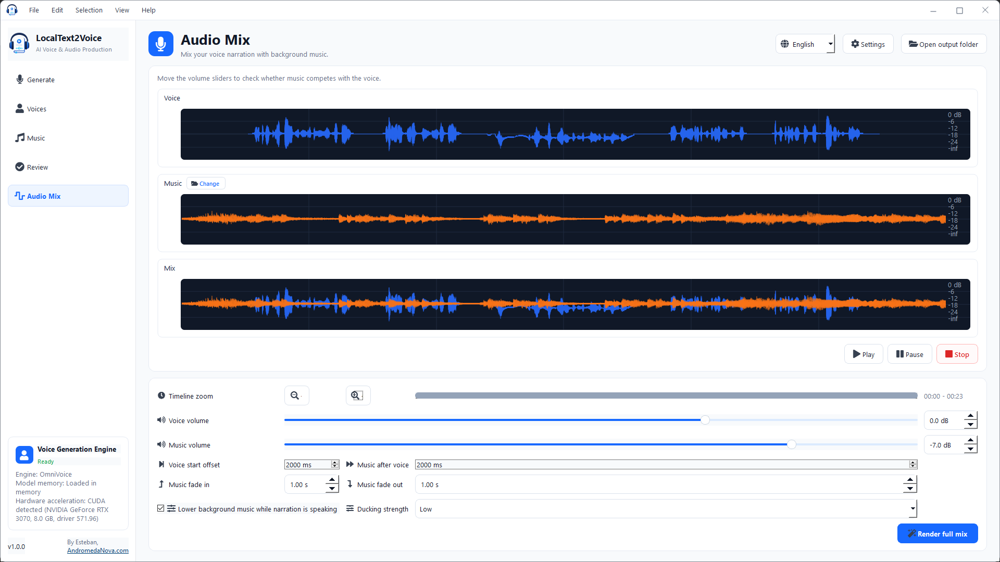
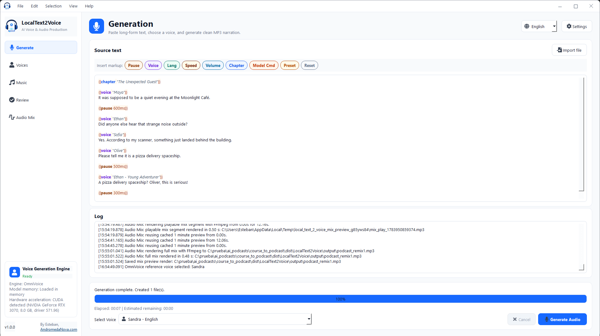
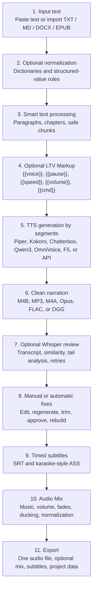

<p align="center">
  
</p>

<h1 align="center">LocalText2Voice</h1>

<p align="center">
  <strong>Free, open-source AI voice and audio production for long-form text.</strong><br>
  Turn books, lessons, articles, notes, and courses into audiobooks and podcast-style audio on Windows and Linux.
</p>

<p align="center">
  <a href="https://github.com/estebanstifli/LocalText2Voice/releases/latest"></a>
  <a href="https://github.com/estebanstifli/LocalText2Voice/blob/main/LICENSE"></a>
  
  
  
  
  
</p>

<p align="center">
  <a href="https://github.com/estebanstifli/LocalText2Voice/releases/latest/download/LocalText2Voice-Setup.exe"><strong>Download Windows installer</strong></a>
  ·
  <a href="docs/LTV_MARKUP.md"><strong>Markup manual</strong></a>
  ·
  <a href="https://andromedanova.com"><strong>AndromedaNova.com</strong></a>
</p>

LocalText2Voice is a desktop app for creating long-form spoken audio with AI text-to-speech. It can run fully local and offline with engines such as Piper, Kokoro, Chatterbox, Qwen3 TTS, OmniVoice, and the optional non-commercial F5-TTS Russian engine, while also leaving room for optional cloud APIs such as OpenAI TTS, ElevenLabs, Google Gemini TTS, and Azure Speech.

The goal is simple: paste or import a long text, choose a voice engine, generate clean narration, review the result, and optionally create a polished podcast mix with music, fades, ducking, and normalization.

## Video Storyboard (Beta)

**In development for the upcoming 2.0.1 release.**

Turn narration into an editable visual timeline, generate or import images,
create video clips, and render an MP4 with the audiobook audio. This beta includes
character and location profiles, scene review, and local or optional remote
visual providers. AI continuity and timing still need human review.

<p align="center">
  <a href="https://www.youtube.com/watch?v=WSU09pJ0rXc">
    
  </a><br>
  <a href="https://www.youtube.com/watch?v=WSU09pJ0rXc"><strong>50 AI Image Styles for Video Storyboards | VideoStoryboard Demo</strong></a>
</p>

Explore the 50 built-in image styles, each with a preview, or create your own
style prompt. Click the demo above to watch on YouTube.

**[Feature guide and development notes](docs/VIDEO_STORYBOARD.md)** ·
[Guía en español](docs/VIDEO_STORYBOARD.es.md) ·
[Official YouTube channel](https://www.youtube.com/@LocalText2Voice)


## System Requirements (Guidance)

LocalText2Voice can run on modest computers, but its actual requirements depend
on the local TTS model, text length, optional transcript verification, and audio
processing features you use. These profiles are practical recommendations, not
strict compatibility limits:

| Profile | Suggested hardware | Suitable for |
| --- | --- | --- |
| Basic | 64-bit 4-core CPU, 8 GB RAM, and 5 GB free disk space; no dedicated GPU required | Editing projects, cloud APIs, and lightweight local generation |
| Recommended | Modern 6-core CPU, 16 GB RAM, SSD with 20–30 GB free, and an NVIDIA CUDA GPU with 8 GB VRAM | Regular use of local neural TTS models with substantially better generation speed |
| High performance | Modern 8-core or better CPU, 32 GB RAM, SSD with at least 50 GB free, and an NVIDIA RTX GPU with 12 GB or more VRAM | Larger local models, long-form production, and optional speech verification with greater headroom |

Supported platforms:

- **Windows 10 or 11, 64-bit:** the Windows installer is the recommended and
  fully packaged distribution.
- **Linux, 64-bit:** currently runs from source and requires Python 3.10+ with
  virtual-environment support and FFmpeg in `PATH`. The [documented Linux
  workflow](docs/LINUX.md) has been tested on Arch/CachyOS with KDE Plasma and
  Wayland.
- **macOS:** not currently tested or officially supported.

An NVIDIA GPU is optional. Most local engines can fall back to CPU execution,
but generation may be considerably slower. GPU acceleration currently focuses
on NVIDIA CUDA; other GPU families should not be assumed to accelerate every
engine. Disk usage also grows with each optional engine because models and
isolated dependencies, including PyTorch runtimes, are downloaded on demand.
Generated projects and exported audio require additional space beyond the
figures above.

## What's New In 1.5.1

- Keep non-looping background music from extending the final mix beyond the
  narration and configured music tail.
- Name rendered mixes from the audiobook project, with filesystem-safe names
  and automatic numbering that prevents overwrites.
- Match exact voice IDs and names before generic tags, avoiding ambiguous
  selections such as a voice tagged `teacher` winning over the voice named
  `Teacher`.
- Use Hindi or enter any language name or ISO code supported by OmniVoice.
- Start with one more bundled ambient track: `To the gates of Eleusis` by
  SamuelFJohanns.

See the complete release history in the [changelog](CHANGELOG.md).

> **Resumen en español:** LocalText2Voice es una aplicación gratuita y open source para convertir libros, cursos y textos largos en audiolibros o podcasts M4B, MP3, M4A, Opus, FLAC u OGG usando IA de voz. Puede funcionar 100% local/offline con modelos descargables, sin suscripciones ni enviar tus textos a la nube. Las APIs externas son opcionales.

## Why It Matters

- **Free local workflow:** no subscription is required for local TTS engines.
- **Privacy-first:** with local engines, your texts and generated audio stay on your PC.
- **Works on normal computers:** Piper and Kokoro can run without a powerful GPU.
- **Scales up on strong PCs:** Chatterbox, Qwen3 TTS, OmniVoice, and F5-TTS Russian can use a selected NVIDIA CUDA GPU when available.
- **Long-form first:** built for chapters, lessons, audiobooks, courses, and large documents.
- **Review loop included:** optional Faster Whisper verification compares generated audio against the original text.
- **Podcast-ready:** export clean narration and then create an Audio Mix with background music.
- **Extensible AI architecture:** local engines and cloud providers are isolated from the UI.

## Screenshot and videos

### Videos

#### Demo

[](https://www.youtube.com/watch?v=CuoBJlbknp4)

#### Review

[Watch the review on YouTube](https://www.youtube.com/watch?v=mOhEeRcX5k0) (in Russian, with the option to dub it into English).

### Screenshots

#### Audio Mix With Music



#### Markup Editor



## Complete Workflow

LocalText2Voice is no longer just "text to speech". It is becoming a complete local audiobook and podcast production pipeline.


```mermaid
flowchart TD
    A["1. Input text<br>Paste text or import TXT / MD / DOCX / EPUB"] --> B["2. Optional normalization<br>Dictionaries and structured-value rules"]
    B --> C["3. Smart text processing<br>Paragraphs, chapters, safe chunks"]
    C --> D["4. Optional LTV Markup<br>{{voice}}, {{pause}}, {{speed}}, {{volume}}, {{cmd}}"]
    D --> E["5. TTS generation by segments<br>Piper, Kokoro, Chatterbox, Qwen3, OmniVoice, F5, or API"]
    E --> F["6. Clean narration<br>M4B, MP3, M4A, Opus, FLAC, or OGG"]
    F --> G["7. Optional Whisper review<br>Transcript, similarity, tail analysis, retries"]
    G --> H["8. Manual or automatic fixes<br>Edit, regenerate, trim, approve, rebuild"]
    H --> I["9. Timed subtitles<br>SRT and karaoke-style ASS"]
    I --> J["10. Audio Mix<br>Music, volume, fades, ducking, normalization"]
    J --> K["11. Export<br>One audio file, optional mix, subtitles, project data"]
```

## Main Features

### AI Text-To-Speech Engines

LocalText2Voice supports multiple voice generation engines through a modular TTS architecture.

| Engine | Type | Best For | Notes |
| --- | --- | --- | --- |
| Piper | Local/offline CPU | Fast, reliable narration on modest PCs | Default stable engine |
| Kokoro | Local/offline CPU/CUDA | Better local quality with on-demand model install | Uses embedded Python runtime |
| Chatterbox | Local GPU/CPU | Advanced voice cloning and expressive speech | CUDA recommended |
| Qwen3 TTS | Local GPU/CPU | Fast preset voices or high-fidelity voice cloning | CustomVoice 0.6B and Base 1.7B, with an accelerated CUDA path |
| OmniVoice | Local GPU/CPU | Multilingual zero-shot TTS with voice design and cloning | Downloaded on demand; pretrained model is CC-BY-NC |
| F5-TTS Russian | Optional local GPU/CPU | Russian voice cloning with automatic stress marks | F5TTS_v1_Base_v2; **non-commercial only (CC BY-NC 4.0)** |
| OpenAI TTS | Cloud API | High-quality remote TTS | Optional API key |
| ElevenLabs | Cloud API | Commercial voices and voice design workflows | Optional API key |
| Google Gemini TTS | Cloud API | Gemini voices and style prompts | Optional API key |
| Azure Speech | Cloud API | Enterprise voices and Azure regions | Optional API key |
| Custom HTTP TTS | Local or remote HTTP | Connect private servers such as local TTS APIs | URL, headers, body template, and response format are configurable |

The base app stays lightweight. Heavy models and isolated Python dependencies are installed on demand into local application storage.

F5-TTS Russian is never included in the base installation. When the user accepts
its non-commercial license and installs the engine, LocalText2Voice creates a
separate runtime containing F5-TTS and Silero Stress and downloads
`F5TTS_v1_Base_v2`. Silero Stress is not installed or loaded for any other
engine; inside F5 it is loaded only when automatic Russian stress marks are
enabled. A clean 3–12 second Russian reference recording and its exact
transcript are required, avoiding an extra automatic-speech-recognition model.
Manual stress marks can be preserved with `+` immediately before the stressed
vowel. RuAccent is not installed: its public repositories currently expose
conflicting license declarations, so the integration uses the clearly MIT
licensed Silero Stress path instead.

Qwen3 TTS exposes two independently downloadable checkpoints in Settings:

- **CustomVoice 0.6B** is the faster option with nine built-in speakers.
- **Base 1.7B** performs full ICL voice cloning from a clean reference recording
  and its exact transcript. It preserves the reference timbre and expression.
  Natural-language style or emotion instructions on Base are experimental and
  are only passed through the accelerated CUDA backend; CPU generation clones
  the expression present in the reference audio.

### Voice Library

- Manage voices from the selected engine.
- Preview available voice samples instantly before installing when the catalog provides audio.
- Sync the external voice catalog from [LocalText2Voice-VoiceGallery](https://github.com/estebanstifli/LocalText2Voice-VoiceGallery).
- Store voice catalog metadata in a local SQLite cache for fast browsing.
- Download only the reference voices you want into the user app data folder.
- Download Piper voices directly from the app.
- Clone Chatterbox, OmniVoice, or F5-TTS Russian voices from uploaded audio,
  a selectable microphone, or a selectable system-audio loopback source.
- Record a recommended 12-second sample directly in the cloning dialog and,
  when Faster Whisper is installed, optionally generate its transcript locally.
- Select the default voice for generation.
- Use flexible voice matching in markup, so `{{voice "edu"}}` can select a longer voice name such as `Eduardo - es`.

### Long-Form Text Processing

- Paste long text directly into the editor.
- Import `.txt`, `.md`, `.docx`, and DRM-free `.epub` books. See the [EPUB import guide](docs/EPUB_IMPORT.md) for metadata, chapters and export options.
- Detect chapters, lessons, modules, Markdown headings, and uppercase short headings.
- Split text into safe TTS chunks.
- Preserve paragraph boundaries.
- Add natural paragraph pauses with randomized ranges.
- Use shorter sentence-aware chunks for engines that behave better with compact prompts.

### LocalText2Voice Markup

LTV Markup lets you control narration from inside the source text:

```text
{{chapter "Lesson 1"}}
{{voice "Serena - Spanish"}}
Bienvenido a esta lección.

{{pause 900ms}}
{{voice "Sohee - English"}}
Now listen to the same idea in English.

{{speed 0.92}}
{{volume 80%}}
This part is slower and softer.
```

Supported commands include:

- `{{voice "..."}}`
- `{{lang es}}`
- `{{pause 700ms}}`
- `{{speed 0.9}}`
- `{{volume 0.8}}`, `{{volume -3db}}`, `{{volume.normalize -16}}`
- `{{cmd "..."}}` for selected model-specific instructions
- `{{reset}}`

The editor includes optional syntax highlighting, contextual help, and a removable Markup Toolbar.

Full manual: [docs/LTV_MARKUP.md](docs/LTV_MARKUP.md)

Technical addon roadmap: [docs/ARCHITECTURE_ADDONS.md](docs/ARCHITECTURE_ADDONS.md)

Voice gallery architecture: [docs/VOICE_GALLERY.md](docs/VOICE_GALLERY.md)

### Text Normalization

Optional text normalization prepares a pronunciation-friendly copy before generation without changing the source text. Settings includes editable SQLite-backed starter dictionaries for Arabic, Chinese, English, French, German, Hindi, Italian, Japanese, Portuguese, Russian, and Spanish. Russian normalization includes numbers, ordinals, percentages, ruble amounts, common abbreviations, and units. When Russian is selected, the user can explicitly install the optional shared Silero Stress runtime from this tab; it runs after the generic rules, restores `Ё`, and is shown in the Normalized preview. F5-TTS Russian receives Silero's `+` stress notation, while other engines receive the safe spelling with `Ё` only. Dictionaries can be created, reset, enabled entry by entry, and imported or exported as JSON for external editing. Automatic rules have a global switch and individual controls for numbers, ordinals, dates, currencies, percentages, measurements, and Roman numerals. Disabling automatic rules does not disable dictionary replacements.

### Whisper Review And Quality Control

Optional Faster Whisper review can validate generated segments:

- Transcribes each generated WAV segment.
- Compares transcript against the original text.
- When text normalization is enabled, normalizes both comparison inputs in memory while preserving Whisper's raw transcript and word timestamps for review and subtitles.
- Calculates similarity, WER, and CER.
- Marks segments as approved, needs review, or needs retry.
- Optionally measures unexplained audio after the last source-aligned Whisper word, with configurable safety, warning, and retry thresholds.
- Supports automatic retry loops.
- Keeps the best combined transcript/tail candidate when multiple retries are attempted.
- Can conservatively trim excessive tails, re-run Whisper, and accept the trimmed candidate only when it reviews better.
- Allows manual segment editing, regeneration, preview, approve/discard, and rebuild.
- Stores word-level timestamps from Whisper for future subtitles, video sync, music cues, and sound effect synchronization.

This makes LocalText2Voice useful not only for quick TTS, but also for quality-controlled audiobook production.

### Subtitles

When Faster Whisper word timestamps are available, LocalText2Voice creates subtitle sidecars next to each finished audio file:

- Standard `.srt` subtitles grouped into readable cues.
- Karaoke-style `.ass` subtitles with word-level timing.
- Correct offsets for podcast mixes whose narration starts after a music intro.
- Sidecars that follow the selected M4B, MP3, M4A, Opus, FLAC, or OGG output.

Subtitle export is refreshed after verification, segment regeneration, tail correction, and audiobook rebuilds.

### Audio Mix

After generating clean narration, the Audio Mix page lets you produce a podcast-style version:

- Keep the clean narration file untouched.
- Choose default background music from the Music Library.
- Preview voice, music, and mix waveforms.
- Play the mixed preview from the cursor or from the start.
- Render a full mix without running TTS again.
- Set voice volume and music volume in dB.
- Add voice start offset for music-only intro time.
- Add music tail after the voice ends.
- Configure fade in and fade out.
- Enable ducking so music drops while narration is speaking.
- Normalize final mix to podcast-friendly loudness.
- Open the output folder directly when rendering finishes.

### Music Library

- Store MP3/WAV music files under `music/background/`.
- Play, stop, rename, remove, and select default music from the UI.
- The app can ship with default music tracks.
- The selected default music is used by Audio Mix.

### Project And Review Data

LocalText2Voice stores project data in SQLite and a portable project manifest:

- Audiobook/project metadata.
- Inline, persistent project names (`Project1`, `Project2`, ... by default) without renaming the physical project folder.
- M4B book metadata, cover art, and named chapter markers; metadata/cover changes can be applied without rerunning TTS.
- Automatic generated covers or normalized custom cover images, including per-book cover selection in Bulk Audiobooks.
- Source text.
- Segment list.
- Segment WAV paths.
- Voice/language/config per segment.
- Review transcript and similarity metrics.
- Word-level Whisper timestamps and review/tail metrics as JSON.
- Rebuild state for edited or regenerated segments.

This prepares the project for future features such as video generation, richer sound-effect timelines, visual scenes, and advanced postproduction.

## What Is Free?

LocalText2Voice itself is free and open source under the MIT License.

The local workflow can be free to run:

- Piper local voices: free/offline, depending on each model license.
- Kokoro local models: downloaded on demand, license depends on the model.
- Chatterbox and Qwen local engines: free to run locally when installed, subject to their upstream licenses and hardware requirements.
- OmniVoice: optional and local; its code is Apache 2.0, while the pretrained model is licensed CC-BY-NC by its authors.
- F5-TTS Russian: optional and local, but its model and generated output are restricted to **non-commercial use** under CC BY-NC 4.0. It is attributed to Misha24-10 and is based on F5-TTS by SWivid.
- FFmpeg: bundled or local, subject to FFmpeg licensing.

Cloud APIs are optional and may be paid:

- OpenAI TTS
- ElevenLabs
- Google Gemini TTS
- Azure Speech

You choose the engine. The app does not force subscriptions.

## Quick Start On Windows

1. Open the [latest release](https://github.com/estebanstifli/LocalText2Voice/releases/latest).
2. Download `LocalText2Voice-Setup.exe`.
3. Run the installer.
4. Choose the application folder and the storage location for large AI assets. By default, an installation in `D:\LocalText2Voice` stores them under `D:\LocalText2Voice\data`.
5. Choose the setup profile:
   - **CPU light**: fast offline Piper workflow.
   - **Powerful GPU**: prepares OmniVoice and Faster Whisper on first launch.
6. Open **Settings > TTS Engines** and choose or install an engine.
7. For Piper, open **Voices** or **Manage voices** and download a voice.
8. Paste or import text.
9. Click **Generate Audio**.
10. Review segments if Whisper review is enabled.
11. Open **Audio Mix** to create the podcast version.

The Windows installer is the recommended distribution artifact. Downloadable models, isolated engine dependencies, fallback Python runtimes, voice-gallery files, and caches share one managed `data` tree. Its location can be moved later from **Settings > General > AI model storage**, including between drives, without moving projects or exported audio.

Installed Windows builds check the latest stable GitHub Release at most once every 24 hours. You can also run a check at any time from **Help > Check for updates**. Before an installer can be opened, both `LocalText2Voice-Setup.exe` and `LocalText2Voice-Setup.exe.sha256` are downloaded and the SHA-256 checksum must match.

Unsigned build note: early public builds may be unsigned until the open source code-signing process is ready. See [Windows installer and future code signing](docs/WINDOWS_INSTALLER_AND_SIGNING.md).

## Quick Start On Linux

Linux currently runs from source. Install Python, virtual-environment support,
Git, and FFmpeg first.

Debian or Ubuntu:

```bash
sudo apt update
sudo apt install python3 python3-venv ffmpeg git
```

Arch Linux:

```bash
sudo pacman -S python ffmpeg git
```

Then clone and start LocalText2Voice:

```bash
git clone https://github.com/estebanstifli/LocalText2Voice.git
cd LocalText2Voice
chmod +x run_dev.sh
./run_dev.sh
```

The launcher creates `.venv`, installs the Python requirements, selects Wayland
when available, and starts the desktop application. For Piper, place the Linux
`piper` executable in `engines/piper/` or make it available through `PATH`;
Linux executables do not use the `.exe` suffix. FFmpeg is discovered through
`PATH`. Optional Python TTS engines can then be installed from the application.

See the complete [Linux guide](docs/LINUX.md) for manual startup, desktop
integration, tests, and platform notes.

## Technical Highlights For AI Engineering

LocalText2Voice is an applied AI engineering project focused on productizing voice models into a real desktop workflow.

- Multi-engine TTS abstraction through `BaseTTSEngine`.
- Local model lifecycle management: install, validate, remove, cache, and run.
- Persistent Python workers for heavy local models to avoid reloading on every segment.
- Embedded Python runtime for optional engines without requiring users to install Python globally.
- External voice gallery with JSON indexes, SQLite cache, remote previews, and per-voice downloads.
- CUDA/CPU auto-selection where supported.
- Long-form text chunking and chapter-aware preprocessing.
- Custom markup language for voice, language, pauses, speed, volume, and model instructions.
- Faster Whisper verification pipeline with similarity scoring and retry logic.
- SQLite persistence for projects, segments, transcripts, review status, and word timestamps.
- FFmpeg audio DSP pipeline for joining, multi-format encoding, speed/volume postprocessing, loudnorm, fades, ducking, and podcast mixing.
- Optional local MCP/HTTP server for automation from local AI clients and agent tools.
- PySide6 desktop UI with background workers, progress, cancellation, logs, translation files, and portable packaging.

## Technology Stack

| Technology | Role |
| --- | --- |
| Python | Application, orchestration, workers, tests |
| PySide6 / Qt | Native Windows desktop UI |
| QtAwesome | Scalable icon system |
| Piper TTS | Fast offline CPU TTS |
| Kokoro ONNX | Optional local neural TTS |
| Chatterbox TTS | Optional advanced local voice/reference engine |
| Qwen3 TTS | Optional local multilingual neural TTS |
| OmniVoice | Optional local zero-shot TTS with voice design/cloning |
| F5-TTS Russian | Optional Russian voice cloning and stress-aware TTS |
| Faster Whisper | Optional transcription and generation review |
| FastAPI + MCP SDK | Optional local automation server |
| Uvicorn | Local ASGI server for HTTP/MCP |
| FFmpeg | M4B/MP3/M4A/Opus/FLAC/OGG export, chapters, conversion, mixing, filters |
| SQLite | Project, segment, transcript, and review data |
| Mutagen | Audio metadata reading plus M4B tags and embedded cover writing |
| PyInstaller | Windows portable build |
| python-docx | DOCX import |

## Architecture

```text
LocalText2Voice/
|-- main.py
|-- app/
|   |-- core/          # Text processing, markup, audio pipeline, projects, SQLite store
|   |-- tts/           # TTS engines, managers, voice catalogs, local/API providers
|   |-- verification/  # Faster Whisper runtime and persistent verifier
|   |-- server/        # Optional local FastAPI/MCP server and job queue
|   |-- ui/            # PySide6 windows, pages, Audio Mix, widgets
|   |-- workers/       # Background generation, install, verification workers
|   |-- utils/         # Paths, FFmpeg, GPU detection, logging
|   `-- llm/           # Future LLM provider interface
|-- docs/
|-- locales/           # JSON UI translations
|-- engines/piper/     # Portable Piper runtime
|-- voices/            # Piper voice models
|-- music/background/  # Music library
|-- ffmpeg/            # Portable FFmpeg
|-- runtimes/          # Embedded Python runtime in portable builds
|-- tests/
`-- output/
```

Voice previews and downloadable reference voices live outside the main code repository in
[LocalText2Voice-VoiceGallery](https://github.com/estebanstifli/LocalText2Voice-VoiceGallery).
The desktop app syncs that JSON catalog into a local SQLite cache and downloads audio assets on demand.

## Local MCP Automation

LocalText2Voice can be automated from local AI clients through MCP.

### MCP stdio bridge

For Claude Desktop, Codex, ChatGPT Desktop, and other clients that launch local
MCP servers through `stdio`, use:

```text
mcp_stdio_bridge.py
```

The stdio bridge starts or reuses the persistent LocalText2Voice EngineHost.
The desktop UI and MCP clients therefore share the same generation queue and
the same loaded TTS model in RAM/VRAM. Saved UI settings are reloaded before
every external job and act as defaults unless a tool argument overrides them.
This includes the selected engine and voice, output, audio parameters, music,
and automatic Faster Whisper review settings.

It exposes:

- `server_info`
- `list_engines`
- `list_voices`
- `list_background_music`
- `create_audiobook`
- `generate_audio`
- `get_jobs`
- `get_job`
- `read_job_source`
- `write_job_source`
- `search_job_source`
- `edit_job_source`
- `replace_job_source_text`
- `cancel_job`
- `preload_engine`
- `unload_engine`
- `engine_memory`
- `get_markup_help`

Example `claude_desktop_config.json` for a source checkout:

```json
{
  "mcpServers": {
    "localtext2voice": {
      "command": "C:\\prueba\\ai_podcasts\\course_to_podcast\\.venv\\Scripts\\python.exe",
      "args": [
        "C:\\prueba\\ai_podcasts\\course_to_podcast\\mcp_stdio_bridge.py"
      ],
      "cwd": "C:\\prueba\\ai_podcasts\\course_to_podcast"
    }
  }
}
```

Example `~/.codex/config.toml` for Codex or ChatGPT Desktop:

```toml
[mcp_servers.localtext2voice]
command = 'C:\prueba\ai_podcasts\course_to_podcast\.venv\Scripts\python.exe'
args = ['C:\prueba\ai_podcasts\course_to_podcast\mcp_stdio_bridge.py']
cwd = 'C:\prueba\ai_podcasts\course_to_podcast'
```

The Windows app generates both configurations with the correct installation
and user paths under **Settings -> Local Server**, with buttons to copy each
block and open the corresponding client configuration file.

Test with MCP Inspector:

```bat
npx @modelcontextprotocol/inspector C:\prueba\ai_podcasts\course_to_podcast\.venv\Scripts\python.exe C:\prueba\ai_podcasts\course_to_podcast\mcp_stdio_bridge.py
```

Start with `server_info`, `list_engines`, `list_voices`, and
`list_background_music`. Then test `create_audiobook` with a short text and
poll `get_job` until it completes.

Completed jobs expose an editable LocalText2Voice project. Use
`read_job_source` to read `source.txt` in character-based pages, or set
`read_all=true` for sources up to 200,000 characters. Large books should be
processed with `page`, `page_size_chars`, and `page_count`; search results also
paginate with `result_offset`. Mutating tools accept `expected_sha256` from a
prior read/search so concurrent clients cannot silently overwrite each other.
Source edits keep SQLite, `source.txt`, and the project manifest synchronized.
Existing MP3 files are retained, and the tool
response reports `render_required=true` when the edited source needs a new
render.

### Optional HTTP/MCP server

The desktop app can also expose a local FastAPI/MCP server from
**Settings -> Local Server**. It is disabled by default and binds to
`127.0.0.1` for Windows desktop use.

Useful endpoints:

- MCP: `http://127.0.0.1:8765/mcp`
- Health: `GET /health`
- Voices: `GET /voices`
- Music: `GET /background-music`
- Jobs: `POST /jobs`, `GET /jobs/{job_id}`, `POST /jobs/{job_id}/cancel`
- Job source: `GET/PUT /jobs/{job_id}/source`
- Source operations: `POST /jobs/{job_id}/source/search`, `/edit`, `/replace`

The MCP tools include generation, job status, and paginated project-source
reading, searching, insertion, deletion, replacement, and full-document writes.
Generated jobs return paths, MIME information, and local URLs for the clean narration and optional mix. Legacy `clean_mp3` and `mix_mp3` aliases remain available for existing clients.
Use the generated access token as a Bearer token for clients that support headers.

## Run From Source

Python 3.10 or newer is recommended:

```powershell
git clone https://github.com/estebanstifli/LocalText2Voice.git
cd LocalText2Voice
py -m venv .venv
.\.venv\Scripts\Activate.ps1
python -m pip install --upgrade pip
python -m pip install -r requirements.txt
python main.py
```

For faster local testing without rebuilding the EXE:

```bat
run_dev.bat
```

The repository does not include large third-party models. Use the UI installers or place runtime files manually when needed.

## Portable Build

```bat
build_windows.bat
```

The build creates a portable folder under:

```text
dist/LocalText2Voice/
|-- LocalText2Voice.exe
|-- engines/
|-- voices/
|-- ffmpeg/
|-- music/
|-- output/
|-- licenses/
|-- runtimes/python311/
|-- config.example.json
|-- LICENSE
`-- THIRD_PARTY_NOTICES.md
```

Large models and optional engine dependencies should stay outside the main executable and be downloaded on demand.

## Windows Installer Build

The tracked Inno Setup definition is `installer/LocalText2Voice.iss`. It is built from the portable `dist/LocalText2Voice/` folder using the local compiler in `.util_instalador_y_firmas/`, which remains ignored because it may contain signing tools and temporary artifacts.

```powershell
.\tools\build_windows_installer.ps1
```

The generated installer is:

```text
.util_instalador_y_firmas/output/LocalText2Voice-Setup.exe
.util_instalador_y_firmas/output/LocalText2Voice-Setup.exe.sha256
```

Installer details, first-run GPU setup behavior, validation notes, and future signing plan are documented in [docs/WINDOWS_INSTALLER_AND_SIGNING.md](docs/WINDOWS_INSTALLER_AND_SIGNING.md).

## Configuration

The app creates `config.json` automatically if it does not exist.

Important settings include:

- Selected TTS engine.
- Output folder.
- UI language.
- Markup Toolbar visibility.
- Editor syntax highlighting.
- Default voice.
- Default music.
- Paragraph pause rules.
- Review/Faster Whisper settings.
- Audio Mix settings.
- API credentials for optional cloud providers.

## Internationalization

The UI is designed for translation through JSON locale files.

Current languages:

- English
- Spanish
- French
- German
- Italian
- Portuguese
- Simplified Chinese
- Japanese
- Arabic
- Hindi
- Russian

## GitHub SEO Keywords

`text-to-speech`, `tts`, `ai-voice`, `offline-tts`, `local-ai`, `piper-tts`, `kokoro-tts`, `chatterbox-tts`, `qwen-tts`, `faster-whisper`, `audiobook`, `podcast`, `mp3`, `python`, `pyside6`, `ffmpeg`, `open-source`, `education`, `course-generator`, `voice-ai`, `speech-synthesis`

Recommended GitHub topics:

```text
text-to-speech
tts
ai-voice
offline-tts
local-ai
piper
kokoro
chatterbox
qwen
faster-whisper
podcast
audiobook
mp3
python
pyside6
ffmpeg
open-source
education
ai-tools
course-generator
```

## Roadmap

- [x] Offline Piper TTS generation.
- [x] Voice manager with download and preview.
- [x] Multiple local engines: Piper, Kokoro, Chatterbox, Qwen3 TTS, OmniVoice, F5-TTS Russian.
- [x] External voice gallery repository with previews and per-voice install flow.
- [x] Optional cloud engines: OpenAI, ElevenLabs, Gemini, Azure.
- [x] Audio Mix page with waveform preview and full mix render.
- [x] Custom LTV Markup.
- [x] Faster Whisper review and segment similarity scoring.
- [x] SQLite project/segment persistence.
- [x] Word-level timestamps for future subtitle and timeline features.
- [x] Sound effects and music timeline commands from markup.
- [x] SRT and karaoke-style ASS subtitle export from Whisper timestamps.
- [ ] Video/audio cover workflow.
- [ ] Visual chapter and segment editor.
- [x] Windows installer with CPU/GPU setup profiles.
- [x] Automatic update system with SHA-256 verification.
- [ ] Signed Windows installer.
- [x] Linux source workflow.
- [ ] Native macOS/Linux packaging.
- [ ] Optional LLM-assisted course/script generation.

## Tests

```powershell
python -m pytest -q
```

The tests cover text processing, markup parsing, audio pipeline behavior, review storage, i18n, engine managers, and UI structure. Real synthesis requires the relevant external models/runtimes.

## Contributing

Issues, feature ideas, translations, docs, and pull requests are welcome.

Please do not commit:

- Large model files.
- API keys.
- Generated build folders.
- Copyrighted music or voice assets without permission.

Read [CONTRIBUTING.md](CONTRIBUTING.md) before submitting changes.

## Acknowledgements

Special thanks to [Roman Kudryavsky (`devpilgrin`)](https://github.com/devpilgrin)
for contributing, testing, and documenting the Linux version of
LocalText2Voice.

Special thanks also to
[Eugene Schelakov](https://www.youtube.com/@AyiTheDeer) for his help with the
Russian localization of the LocalText2Voice user interface and for creating a
detailed video about the project for the Russian-speaking community.

## TTS Engine And Model Credits

LocalText2Voice is possible because researchers, open-source maintainers, model
authors, and commercial voice providers have made strong speech technology
available to developers. Thank you to the following upstream projects and
teams:

| Engine or provider | Upstream project and models | LocalText2Voice integration |
| --- | --- | --- |
| Piper | [Rhasspy Piper](https://github.com/rhasspy/piper) and the [Piper voice catalog](https://huggingface.co/rhasspy/piper-voices) | Bundled lightweight Windows runtime; voices are optional downloads with model-specific licenses |
| Kokoro | [Kokoro-82M](https://huggingface.co/hexgrad/Kokoro-82M) by hexgrad and [kokoro-onnx](https://github.com/thewh1teagle/kokoro-onnx) by thewh1teagle | Optional ONNX runtime and voice bundle downloaded on demand |
| Chatterbox | [Chatterbox TTS](https://github.com/resemble-ai/chatterbox) by Resemble AI | Optional local multilingual and reference-voice generation |
| Qwen3 TTS | [Qwen3-TTS](https://github.com/QwenLM/Qwen3-TTS) by the Qwen team, including [CustomVoice 0.6B](https://huggingface.co/Qwen/Qwen3-TTS-12Hz-0.6B-CustomVoice) and [Base 1.7B](https://huggingface.co/Qwen/Qwen3-TTS-12Hz-1.7B-Base) | Optional preset-voice and ICL voice-cloning models |
| OmniVoice | [OmniVoice](https://github.com/k2-fsa/OmniVoice) by k2-fsa and its [pretrained model](https://huggingface.co/k2-fsa/OmniVoice) | Optional multilingual cloning and voice design; pretrained model is CC-BY-NC |
| F5-TTS Russian | [F5-TTS Russian](https://huggingface.co/Misha24-10/F5-TTS_RUSSIAN) by Misha24-10, based on [F5-TTS](https://github.com/SWivid/F5-TTS) by SWivid, with [Silero Stress](https://github.com/snakers4/silero-stress) | Optional Russian cloning and stress processing; F5-TTS Russian is CC BY-NC 4.0 |
| OpenAI | [OpenAI Audio API](https://platform.openai.com/docs/api-reference/audio) | Optional cloud TTS using the user's API credentials |
| ElevenLabs | [ElevenLabs Text to Speech](https://elevenlabs.io/docs/overview/capabilities/text-to-speech) | Optional cloud voices using the user's API credentials |
| Google | [Gemini text-to-speech](https://ai.google.dev/gemini-api/docs/speech-generation) | Optional controllable cloud speech generation |
| Microsoft | [Azure Speech](https://learn.microsoft.com/en-us/azure/ai-services/speech-service/overview) | Optional cloud neural voices and SSML |

LocalText2Voice is an independent project and is not endorsed by these upstream
projects or providers. Each engine, model, voice, dataset, and API remains
subject to its own license and terms. See [THIRD_PARTY_NOTICES.md](THIRD_PARTY_NOTICES.md)
before redistribution or commercial use.

## License

LocalText2Voice source code is released under the [MIT License](LICENSE).

Third-party engines, models, voices, FFmpeg, Qt/PySide6, music files, and API providers keep their own licenses. Always check model cards and redistribution terms before publishing a packaged build.

## Author

Created by [Esteban](https://andromedanova.com) at [AndromedaNova.com](https://andromedanova.com).

If LocalText2Voice helps you, please star the repository. It makes the project easier to discover for people looking for free local AI voice tools.
